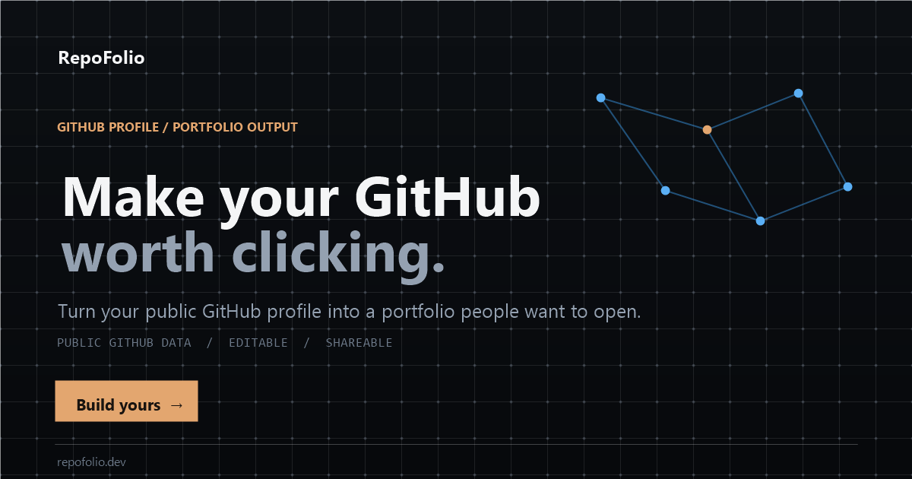

# RepoFolio

> Create a professional developer portfolio from GitHub in 60 seconds.

RepoFolio turns a public GitHub profile into a polished, editable developer portfolio. It is intentionally still a small product: no signup, payments, or AI. This version is focused on launch readiness — strong generation, autosaved editing, professional templates, a real example portfolio, shareable state, clean PDF export, accessibility basics, SEO metadata, and simple deployment.

<p align="center">
  
</p>

## Three presentation layers, one portfolio model

Every template renders the same `PortfolioData`. Switching a template never duplicates or resets content.

- **Minimal** — restrained, recruiter-first typography and straightforward project rows.
- **Modern** — polished product-oriented layout with a dark premium feel.
- **Creative** — editorial typography, asymmetric portrait composition, animated metadata rail, numbered sections, and curated project rows instead of a generic card grid.

## Product hypothesis

Many students, junior developers, recent graduates, and freelancers have useful GitHub work but no portfolio they are proud to send to a recruiter.

RepoFolio tests one question:

**Can a developer go from GitHub username to a portfolio they genuinely want to share in under a minute?**

## Features

### GitHub generation

- GitHub username or profile URL input
- Public profile + up to 100 owner repositories
- Repository ranking based on community signal, freshness, description quality, language, homepage, topics, and fork/archive penalties
- Default selection of the strongest six projects
- Skills derived from repository languages
- Repository topics reused as project technologies where available
- Friendly invalid-user, rate-limit, server-error, loading, zero-repository, and many-repository states

### Portfolio editor

- Three templates: **Minimal, Modern, Creative**
- Switch templates without changing portfolio content
- Project select/deselect
- Project reordering
- One featured project that leads the portfolio presentation
- Editable project title, description, technologies, GitHub link, and optional live demo URL
- GitHub stars and forks
- Editable hero, name, headline, bio, location, profile image URL, and availability
- Editable/hideable sections:
  - About
  - Experience
  - Education
  - Certifications
  - Achievements
  - Skills
  - Projects
  - Contact
- Repeatable entries for experience, education, certifications, and achievements
- Per-GitHub-user local autosave with draft restoration after refresh/reopen
- Reset to fresh GitHub data without requiring an account
- Lightweight portfolio readiness checklist

### Appearance

- Light and dark modes
- Accent color presets + native custom color picker
- Clean sans, editorial serif, and developer mono font stacks
- Responsive profile image treatment per template
- Reduced-motion support

### Launch-ready public experience

- Real `/example` portfolio route that works without GitHub input
- Polished landing flow with a direct example CTA
- Generic Open Graph / Twitter social preview image
- Dynamic browser title, description, canonical URL, theme color, and robots metadata per route
- Favicon, web app manifest, and `robots.txt`
- Portfolio referral footer: **Made with RepoFolio**
- Skip links, keyboard focus styling, reduced-motion handling, and improved responsive states
- Dedicated 404, generation loading, GitHub error, and public-portfolio error views
- Vercel SPA rewrites plus basic security/cache headers

### Preview, sharing, and export

- Live preview while editing
- Desktop/mobile preview controls
- Dedicated final portfolio preview in a new tab
- Copyable client-side share URL
- Versioned, Unicode-safe portfolio serialization
- Backward-compatible restoration of v1 share links
- Browser-native **Download PDF** via print / Save as PDF
- Print-specific layout that removes the studio UI

## Tech stack

- React 19
- TypeScript
- Vite
- Tailwind CSS 4 for the app shell/editor
- Purpose-built CSS for generated portfolio templates
- Lucide React
- Vitest
- GitHub REST API

Saved sharing requires the Vercel API and PostgreSQL; local editing and previews remain browser-based.

## Architecture

```text
Browser
  │
  ├── LandingPage
  │     ├── username / github.com/username
  │     └── /example portfolio
  │
  ├── GitHub REST API
  │     ├── GET /users/{username}
  │     └── GET /users/{username}/repos?per_page=100&sort=updated&type=owner
  │
  ├── portfolio.ts
  │     ├── rankRepositories()
  │     ├── derive skills / technologies
  │     ├── createPortfolioData()
  │     ├── schema v3 normalization / migration
  │     └── base64url serializer
  │
  ├── StudioPage
  │     ├── content editor
  │     ├── project manager
  │     ├── section editor
  │     ├── appearance editor
  │     ├── localStorage draft autosave
  │     ├── readiness feedback
  │     └── live desktop/mobile preview
  │
  └── PortfolioView
        ├── MinimalTemplate
        ├── ModernTemplate
        └── CreativeTemplate
```

The important boundary is:

```text
PortfolioData = content + projects + sections + appearance
Template      = presentation only
```

That makes future templates cheap to add without copying business logic.

## Shared portfolio data model

The client model is explicitly versioned:

```ts
interface PortfolioData {
  version: 3
  username: string
  avatarUrl: string
  name: string
  headline: string
  bio: string
  location: string
  githubUrl: string
  website: string
  email: string
  skills: string[]
  projects: PortfolioProject[]
  hero: PortfolioHero
  appearance: PortfolioAppearance
  sections: PortfolioSections
}
```

`encodePortfolio()` stores an envelope containing a schema version and the portfolio. `decodePortfolio()` normalizes the payload and migrates legacy v1/v2 URLs into the v3 model.

The sharing API persists the same normalized PortfolioData document used by the templates.

## Local draft architecture

Editing does not require an account. The studio autosaves the current `PortfolioData` document to `localStorage` under a key scoped to the GitHub username. Returning to the same studio route restores that draft automatically. **Reset to GitHub** clears the local draft and regenerates the portfolio from the public GitHub API.

Drafts stay local. Copy link explicitly saves a public snapshot to PostgreSQL.

## Sharing architecture

Current shared route: `/p/<username>/<uuid>`. The public page retrieves its saved snapshot from `/api/portfolios?id=<uuid>`. Repeated sharing of identical content in the same session reuses the link; changed content gets a new immutable snapshot. Unselected projects are excluded.

Local preview and PDF use `/preview/<username>`. Old `/portfolio/<username>?data=...` links remain readable for compatibility. See Saved portfolio links below for database setup.

## GitHub API behavior

RepoFolio uses public REST resources only. It deliberately avoids one follow-up request per repository.

```text
GET https://api.github.com/users/{username}
GET https://api.github.com/users/{username}/repos?per_page=100&sort=updated&type=owner
```

Unauthenticated public REST usage is rate-limited by GitHub per originating IP. No personal token is exposed in the browser.

A profile email appears only when GitHub exposes it publicly; users can add/edit the email in the studio.

## Repository ranking

Repositories are not sorted alphabetically. `scoreRepository()` considers:

- stars using a logarithmic community signal
- forks
- recent pushes
- description presence
- primary language
- homepage presence
- repository topics
- fork penalty
- archive penalty

All fetched repositories remain editable in the studio. The strongest six are merely the initial selection.

## SEO and social sharing

The static `index.html` contains generic RepoFolio Open Graph / Twitter metadata and a 1200×630 preview image. Route-level metadata is updated in the browser through `src/lib/seo.ts` for the landing page, studio, example, and public portfolio routes.

Because this is still a pure client-side Vite SPA, social crawlers that do not execute JavaScript will receive the generic RepoFolio card rather than a unique card for each encoded portfolio. Fully dynamic per-portfolio Open Graph images/titles should be introduced using server-side metadata or an edge-rendered route.

## Local development

### Requirements

- Node.js 20+
- npm 10+

### Install

```bash
git clone <your-repo-url>
cd repofolio-mvp
npm install
```

### Run

```bash
npm run dev
```

### Tests

```bash
npm test
```

### Production build

```bash
npm run build
```

### Full check

```bash
npm run check
```

## Environment variables

**None are required.**

Do not put a GitHub personal access token in a Vite client environment variable. Client-side variables are inspectable. If authenticated GitHub access is added later, keep credentials in a small server/serverless API layer.

## Test coverage included

- username / GitHub URL normalization
- intelligent repository ranking
- zero repositories
- 100 repositories
- default project selection + featured-project migration
- skill and technology derivation
- v3 serialization round-trip with Unicode
- v1/v2 share-link migration
- hidden-project removal from public URLs
- local draft save/restore/reset behavior
- portfolio readiness calculation
- GitHub 404 handling
- GitHub rate-limit handling
- repository request shape
- all three templates rendering from the same data model

The template CSS is container-responsive. Desktop and 390px mobile layouts were visually exercised for Minimal, Modern, and Creative during development.

## PDF export

The studio's **Download PDF** action opens a clean portfolio-only print route, waits for fonts/images, then launches the browser print dialog. A4 print CSS preserves the selected portfolio mode, accent colors, typography and template composition while preventing horizontal cropping and keeping project/timeline rows together where practical. Chrome may still show its own URL/date header-footer unless the browser's “Headers and footers” print option is disabled.

Choose **Save as PDF** in Chrome/Edge/Safari.

This is intentionally simpler than adding `html2canvas`, `jsPDF`, or a server-side PDF renderer to the MVP.

## Project structure

```text
repofolio-mvp-v6/
├── docs/
│   ├── landing-preview.svg
│   ├── template-minimal.png
│   ├── template-modern.png
│   ├── template-creative.png
│   └── template-mobile.png
├── src/
│   ├── components/
│   │   ├── templates/
│   │   │   ├── shared.tsx
│   │   │   ├── MinimalTemplate.tsx
│   │   │   ├── ModernTemplate.tsx
│   │   │   └── CreativeTemplate.tsx
│   │   ├── LandingPage.tsx
│   │   ├── PortfolioView.tsx
│   │   ├── PortfolioView.test.tsx
│   │   ├── PublicPortfolioPage.tsx
│   │   └── StudioPage.tsx
│   ├── lib/
│   │   ├── draft.ts
│   │   ├── draft.test.ts
│   │   ├── github.ts
│   │   ├── github.test.ts
│   │   ├── portfolio.ts
│   │   ├── portfolio.test.ts
│   │   ├── readiness.ts
│   │   └── readiness.test.ts
│   ├── App.tsx
│   ├── index.css
│   ├── main.tsx
│   └── types.ts
├── package.json
├── vite.config.ts
└── vercel.json
```

## Routes

| Route | Purpose |
| --- | --- |
| `/` | Landing + GitHub input |
| `/example` | Real launch/demo portfolio without GitHub input |
| `/studio/:username` | Generate, edit, customize, preview, export |
| `/p/:username/:id` | Saved public portfolio snapshot (legacy `/p/:id` also works) |
| `/preview/:username` | Local draft preview and PDF |
| `/portfolio/:username?data=...` | Legacy shared portfolio |
| `/:username` | Reserved future architecture for persisted portfolio slugs |

## Deployment

The fastest deployment path is Vercel:

1. Push the project to GitHub.
2. Import the repository into Vercel.
3. Use `npm run build` with `dist` as the output directory (Vercel normally detects Vite automatically).
4. Configure DATABASE_URL, apply migrations/001_shared_portfolios.sql, then deploy and attach your domain.
5. Verify `/`, `/example`, `/studio/<username>`, and a copied `/p/...` URL directly in a fresh browser tab.

`vercel.json` includes the SPA rewrite needed for direct visits to nested routes, conservative security headers, and long-lived caching for fingerprinted `/assets/*` files.

## Intentional product limits

- no accounts
- no analytics yet
- no custom domains yet
- no payments
- no AI copywriting
- no true GitHub pinned-repository import
- no private repositories
- shared snapshots are immutable; editing requires copying a new link

Those are product decisions for this stage, not accidental missing architecture.

## What should come next

Do not add everything at once. Validate sharing first, then consider account-owned links:

1. **Persistent short portfolio slugs** such as `repofolio.dev/aya`.
2. **Optional account/GitHub OAuth** only when persistence or higher GitHub limits justify it.
3. **Custom domains** as a strong paid feature.
4. **Premium template/customization pack** while keeping the free generator useful.
5. **Simple view/click analytics** for job-seeking users.

Payments should come after users repeatedly create and share portfolios, not before.

## Product metric to watch

The most important early metric is:

> **What percentage of generated portfolios are opened/shared after editing?**

If users generate but do not share, improve portfolio quality before adding monetization.

## License

MIT


## Saved portfolio links

Sharing uses the PostgreSQL database configured by `DATABASE_URL` for `api/session.ts`.
Apply `migrations/001_shared_portfolios.sql` to that database before deploying the frontend and API together. The existing `sessions` table must already exist. Never expose the connection string through a VITE_ variable.

Use `npx vercel dev` for local frontend and API development after linking the project and pulling development environment variables. Vite alone does not execute API functions. SPA rewrites target only application page routes so Vite modules and runtime URLs are not rewritten to HTML.

Copy link saves an immutable snapshot at `/p/<username>/<uuid>`. Identical content in the same session reuses its link; edits create a new link. Anyone with the link can read it. Unselected projects are excluded. Failed saves show an error, with no fallback to a long URL. The visible link field supports manual copying.

Preview and PDF use `/preview/<username>` to read the latest local draft without publishing. These URLs work only in the editing browser. Existing encoded portfolio links remain supported.

No live database migration or deployment has been performed. Apply the migration and verify a saved link in a separate browser before release. The API limits payloads to 256 KB and new snapshots to 100 per session per day; platform rate limiting is also recommended for anonymous traffic.

Each Copy link request checks the server; identical active snapshots are deduplicated there. Unpublished links are never reused. Snapshot responses use no-store. Photo responses allow private browser revalidation, with an access check on every request and no shared CDN caching of the API response. An already open page, downloaded photo, or response cached by the previous deployment cannot be recalled. The previous deployment allowed five-minute browser and one-hour CDN caching.

## Custom profile photos

In **Hero → Profile photo**, choose **Upload photo**, adjust the crop with Zoom and position sliders, then select **Save photo**. JPG, PNG and WebP files up to 10 MB are accepted. The browser crops to a 512 × 512 JPEG before uploading. The server decodes and re-encodes it, strips metadata, and stores it in private Vercel Blob storage. **Delete photo** permanently deletes the current upload and restores the GitHub avatar. **Past uploads** lets users remove older photos. The existing Show profile image switch controls whether the photo appears.

### One-time setup

1. In the Vercel project's **Storage** tab, create/connect a **private Blob store**. Include Development, Preview, and Production, use prefix `PRIVATE_BLOB`, and enable a read-write token. The server expects `PRIVATE_BLOB_READ_WRITE_TOKEN`. Keep the old public store and its original `BLOB_READ_WRITE_TOKEN` while migrating old photos; these are two different tokens for two different stores.
2. In the Neon SQL Editor, apply `migrations/002_profile_photo_uploads.sql` if needed, then `migrations/003_private_photos.sql` in the database/branch used by `DATABASE_URL`. Existing `sessions` and `shared_portfolios` tables are required. Apply to each environment's database. Coordinate migration 003 with the new deployment because it changes the shared-link uniqueness constraint.
3. From this project folder, run:

   ```sh
   npm install
   npx vercel pull --environment=development
   npx vercel dev
   ```

   Run `npx vercel link` first only if this local project is not already linked. Restart Vercel dev after pulling variables. Normal later starts only need `npx vercel dev`. Vite alone cannot run the upload API.
4. Deploy the updated code after connecting the private store. Never give either token a `VITE_` prefix or put it into browser code. Neon stores the private image URL and owner session; the browser receives only an access-checked `/api/profile-photo?id=...` reference.

Official setup reference: https://vercel.com/docs/vercel-blob/private-storage

### How shared photos work

- Saving a photo uploads a private image. Before sharing, only the owning session cookie can read it through the backend. No redirect or private Blob URL is returned to a visitor.
- **Copy link** validates photo ownership and attaches its ID to the snapshot. Visitors receive a photo endpoint URL containing that snapshot's ID. The backend checks that the exact snapshot is active, references this photo, and shows the photo. Knowing only a photo ID does not grant access.
- In **Shared links**, load links owned by this browser and **Unpublish** individual snapshots. Republishing creates a new link; other active snapshots remain available.
- In **Hero → Delete photo**, deletion removes the current upload from all portfolios using it and restores the GitHub avatar in both the editor and existing shared links. **Past uploads** lets users remove older photos. Access is revoked before storage deletion. If storage deletion fails, retry it from the editor or Past uploads. A photo remains in the management list until deletion finishes.
- Hiding a photo in the current draft does not delete uploads or alter already shared snapshots. GitHub-hosted photos remain subject to GitHub's own public access.
- Ownership is currently tied to a browser session, not a verified GitHub account. Clearing/losing cookies or switching devices loses self-service access. Administrator-assisted recovery/deletion and account ownership are separate future work. Uploaded photos remain stored until deleted; scheduled retention cleanup is not yet implemented.
- Test a deployed portfolio in a private/incognito window: upload, Save photo, Copy link, then open the copied link there. A localhost portfolio link is only accessible on your own computer even though its image is stored online.
- Upload attempts are limited to 20 per anonymous session per day, including failures. Session limits are not account authentication; use platform request limits for public anonymous uploads.

The Blob store and migration must be configured before uploads will work. This code does not create cloud resources or run migrations automatically.

### Migrating existing public photos

Existing public objects do not become private when new uploads switch stores. Do not delete the old store first. Back up Neon, pause photo/sharing writes for the cutover, apply migration 003, and deploy the new code. Old photos are withheld by the new backend until copied to private storage; unchanged public Blob URLs still work until their files are removed.

From the project folder, use an environment file with the database being migrated and BOTH store tokens. For local development, `vercel pull` puts these in `.vercel/.env.development.local`. Production migration must use the production database/tokens, not an unrelated preview branch.

```sh
# Report only; no data changes
node --env-file=.vercel/.env.development.local scripts/migrate-private-photos.mjs

# Copy images, verify their bytes, then update Neon and existing snapshot references
node --env-file=.vercel/.env.development.local scripts/migrate-private-photos.mjs --apply
```

Verify photos in the editor, an existing public link, and incognito. The portfolio URLs keep their existing IDs. Old local drafts resolve their former public image URLs through the backend using the retained legacy mapping. Then remove the old public copies:

```sh
node --env-file=.vercel/.env.development.local scripts/migrate-private-photos.mjs --apply --purge-public
```

The cleanup flag is a deliberate deletion step. It only removes originals for records with a readable private copy. The script can be rerun after interruption and never deletes the entire store. Objects with no completed upload record, previously deleted records, and files outside this app need a separate administrator audit in the old Blob dashboard. Do not assume the old store is empty just because the migration has finished. Keep its token until legacy deletions and that audit are complete.

Private access cannot revoke a previously downloaded image or an older browser/CDN cache. Legacy encoded `?data=` links also cannot be unpublished through the saved-link manager; migrated/deleted photo access is still enforced by the photo endpoint in the updated app.

### Targeted checks (no live cloud resources used)

```sh
node scripts/profile-photo.test.cjs
node scripts/sharing.test.cjs
node scripts/private-photo-access.test.cjs
node scripts/photo-migration.test.mjs
```
